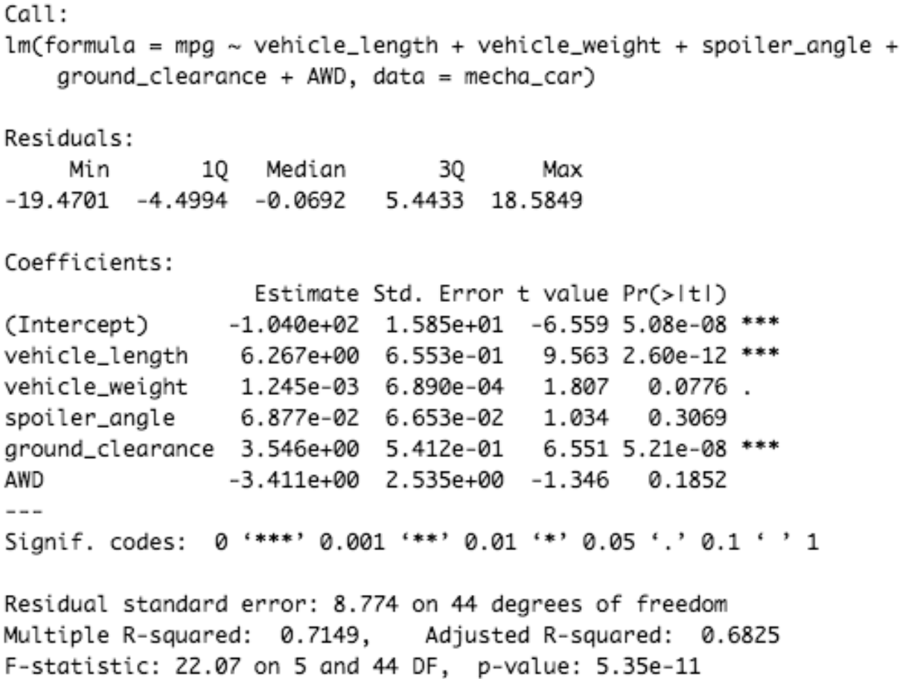
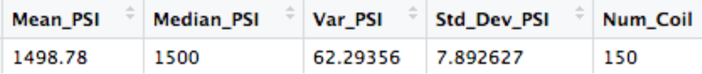
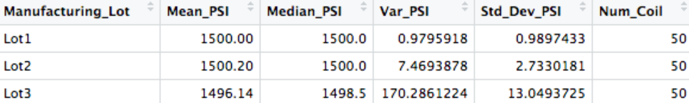
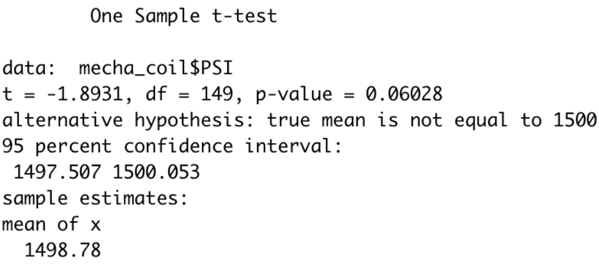
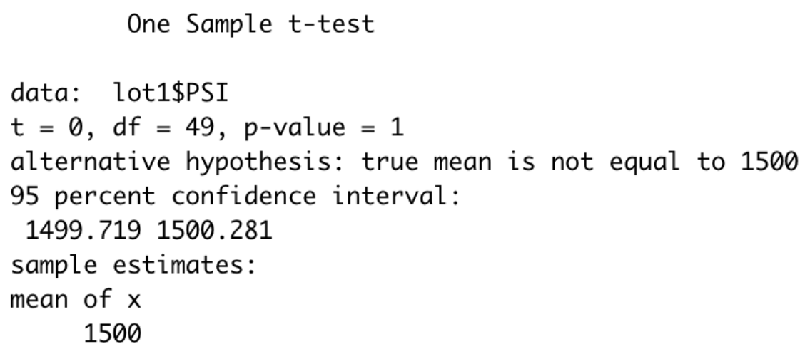
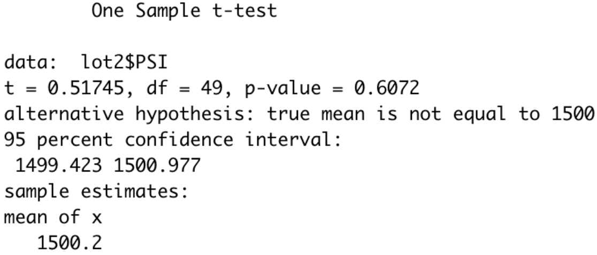
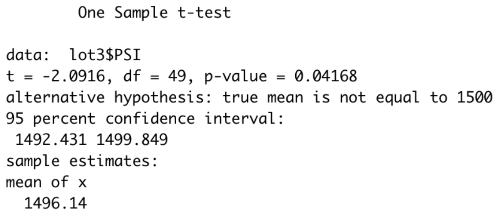

# MechaCar Statistical Analysis

**Christopher Madden** | [LinkedIn](http://bit.ly/4uMMPV7) | [GitHub Portfolio](https://bit.ly/3Pz5LS3)

---

## Project Overview

This project applies statistical analysis and regression modeling in R to evaluate vehicle performance data for a fictional automotive manufacturer, MechaCar. The goal is to identify which vehicle design factors most significantly influence fuel efficiency, assess manufacturing consistency across production lots, and propose a competitive benchmarking study framework.

This is a portfolio project completed as part of my Data Analytics Certificate program at Case Western Reserve University (2022), demonstrating applied statistical analysis skills relevant to real-world business and operations data problems.

---

## Tools & Skills Demonstrated

- **Language:** R
- **Libraries:** tidyverse, ggplot2
- **Techniques:** Multiple linear regression, one-sample t-tests, two-sample t-tests, ANOVA, chi-squared tests
- **Competencies:** Hypothesis testing, statistical interpretation, data visualization, business reporting

---

## Dataset

Two datasets are used in this analysis:

- `MechaCar_mpg.csv` — Vehicle prototype performance metrics including vehicle length, weight, spoiler angle, ground clearance, AWD configuration, and miles per gallon (mpg)
- `Suspension_Coil.csv` — Suspension coil manufacturing data across multiple production lots, including PSI measurements

---

## Analysis Summary

### 1. Linear Regression to Predict MPG

A multiple linear regression model was built to identify which vehicle design variables have a statistically significant effect on fuel efficiency (mpg).



**Key findings:**
- Vehicle length and ground clearance are the strongest predictors of mpg, with statistically significant p-values
- Vehicle weight, spoiler angle, and AWD configuration do not significantly contribute to mpg variance
- The model produces an R-squared value indicating reasonable predictive reliability for MechaCar prototypes
- The overall p-value is small enough to reject the null hypothesis — the slope of the model is not zero

**Resulting model:**
```
mpg = (6.267)vehicle_length + (0.0012)vehicle_weight + (0.0688)spoiler_angle + (3.546)ground_clearance - (3.411)AWD - 104
```

---

### 2. Summary Statistics on Suspension Coils

Manufacturing specifications require that suspension coil variance must not exceed 100 PSI. This analysis evaluates whether production lots meet that standard individually and in aggregate.

**All lots combined:**



**Individual lot breakdown:**



**Key findings:**
- In aggregate, all lots combined fall within the 100 PSI variance threshold
- Lot 1 and Lot 2 individually meet the specification with low variance
- Lot 3 individually **fails** the specification with variance exceeding the threshold
- This demonstrates a critical insight: aggregated data can mask quality control failures at the component level — a finding highly relevant to manufacturing operations and QA reporting

---

### 3. T-Tests on Suspension Coils

One-sample t-tests were performed to determine whether each manufacturing lot's mean PSI is statistically different from the population mean of 1,500 PSI.

**All lots combined:**



**Lot 1 and Lot 2:**




**Lot 3:**



**Key findings:**
- Lots 1 and 2 show p-values above the significance threshold — we fail to reject the null hypothesis; their means are not statistically different from the population mean
- Lot 3 shows a low p-value — we reject the null hypothesis; Lot 3's mean PSI is statistically different from the population mean, confirming a manufacturing consistency issue

---

### 4. Study Design: MechaCar vs. Competition

A proposed statistical study framework to benchmark MechaCar's environmental performance against competitors.

**Research question:** Do MechaCar's manufacturing and operational carbon emissions differ significantly from similarly sized competitors?

**Hypothesis:**
- *Null:* MechaCar's carbon emissions are not statistically different from competitors
- *Alternative:* MechaCar's carbon emissions are statistically different from competitors (outperforming or underperforming)

**Proposed test:** One-tailed t-test comparing MechaCar emissions data against competitor benchmarks, using pre- and post-innovation data to measure the impact of new manufacturing processes

**Data required:** Total facility emissions per company, per-vehicle-model emissions data, and MechaCar before/after innovation comparison data

---

## Repository Structure

```
MechaCar_Statistical_Analysis/
├── MechaCarChallenge.R       # All R analysis code
├── MechaCar_mpg.csv          # Vehicle performance dataset
├── Suspension_Coil.csv       # Manufacturing lot dataset
├── Images/                   # Output visualizations and statistical results
└── README.md
```

---

## About the Author

I am a Data Analyst with experience in SQL, Python, R, Power BI, Tableau, and Excel. I specialize in data cleaning, statistical analysis, dashboard development, and translating complex data into clear business insights.

📧 maddenc33@gmail.com | [LinkedIn](http://bit.ly/4uMMPV7) | [GitHub](https://bit.ly/3Pz5LS3)
